# 📚 Documentation

---

Welcome to `basic_patterns` folder, this folder contains the **pattern problems** and it's concepts.

---

## 📂 Folder Structure

The Folder right now is organized in following way:

* **`image/`** - It contains the image illustrations of patterns.

* **`pattern_x.cpp`** - These are the main source files, where the code for specific pattern is stored, according to numbering.

---

## 💡 Important Pattern Problems

### Pattern 1 ✅

### Pattern 2 ✅

### Pattern 3 ✅

### Pattern 4 ✅

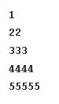

### Pattern 5 ✅
 

### Pattern 6 ✅

### Pattern 7 ✅

### Pattern 8 ✅

### Pattern 9 ✅

### Pattern 10 ✅

### Pattern 11 ✅

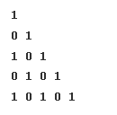

### Pattern 12 ✅

### Pattern 13 ✅

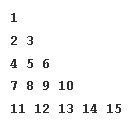

### Pattern 14 ✅ ⭐

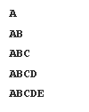

### Pattern 15 ✅

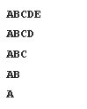

### Pattern 16 ✅

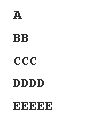

### Pattern 17 ✅

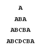

### Pattern 18 ✅

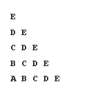

### Pattern 19 ✅

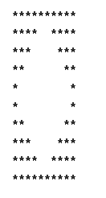

### Pattern 20 ✅ ⭐

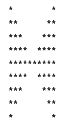

### Pattern 21 ✅

### Pattern 22 ✅ ⭐

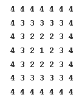

---

### 🎗️ Completed 🎗️

---

*Hope you have a nice day ahead ✨*

-- `RenSyntax`
